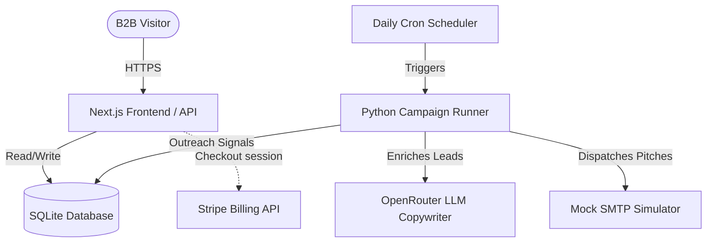

# SalesAgentic.ai Production Deployment Guide

To deploy the website and backend infrastructure under your domain **salesagentic.ai**, we must configure an environment that supports:
1. **Next.js Web Server** (Node.js runtime).
2. **Persistent Disk Storage** (to read/write the SQLite `registry.db` safely).
3. **Python Runtime & Package Manager** (to execute the campaign runner and harvesters).
4. **Cron Job Execution** (to trigger daily outbound email sprints).

Because serverless platforms like Vercel have **stateless/ephemeral filesystems** (which would wipe or corrupt your SQLite database on every request), we recommend deploying on **Render (Web Service)**, **Railway**, **Fly.io**, or a **VPS (DigitalOcean / AWS EC2)**. 

Below is the step-by-step deployment guide for **Render** (easiest PaaS setup) and **VPS** (most robust self-hosted setup).

---

## Architecture Blueprint



---

## Phase 1: Environment Variables & Secrets

Make sure you have these values ready to inject into your hosting environment:
* `STRIPE_SECRET_KEY`: Your live Stripe API secret key.
* `STRIPE_WEBHOOK_SECRET`: Your Stripe webhook signing secret (obtained after configuring webhook endpoints).
* `OPENROUTER_API_KEY`: Your OpenRouter API key (to generate personalized email copy).
* `REGISTRY_DB_PATH`: The absolute file path to the database file on the persistent volume (e.g. `/data/registry.db`).

---

## Phase 2: Deploying to Render (Recommended PaaS)

Render is the simplest way to host Node + Python apps with persistent disk support.

### 1. Push code to GitHub
Initialize a private git repo, commit the code, and push it to GitHub:
```bash
git init
git add .
git commit -m "feat: complete production landing page & lead marketplace"
# Add your private GitHub repository remote and push:
git remote add origin git@github.com:YOUR_USERNAME/salesagentic_web.git
git branch -M main
git push -u origin main
```

### 2. Configure Render Web Service
1. Log in to [Render Dashboard](https://dashboard.render.com/) and click **New > Web Service**.
2. Connect your GitHub repository `salesagentic_web`.
3. Choose the following settings:
   * **Runtime**: `Node`
   * **Build Command**: `npm run build`
   * **Start Command**: `npm run start`
   * **Instance Type**: Starter (or any tier supporting Persistent Disks).

### 3. Add Persistent Disk Storage
Because SQLite database must persist across builds:
1. Navigate to the **Disks** section in your Render Web Service settings.
2. Click **Add Disk**:
   * **Name**: `registry-db-volume`
   * **Mount Path**: `/data`
   * **Size**: `1 GB` (more than enough for SQLite logs).
3. Update your `REGISTRY_DB_PATH` environment variable to point to `/data/registry.db`.
4. Copy your current SQLite file `registry.db` from your local machine to the Render disk using the Render shell or command line tool:
   ```bash
   scp data/registry.db service-id@ssh.render.com:/data/registry.db
   ```

### 4. Setup Python Environment
Since Next.js runs in Node, we need both Node.js and Python available. On Render, you can use the **Docker** runtime instead of Node to easily bundle both runtimes:
1. Create a `Dockerfile` in the root of the project:
   ```dockerfile
   FROM node:20-alpine AS base

   # Install Python and dependencies
   RUN apk add --no-cache python3 py3-pip py3-pillow py3-playwright build-base sqlite

   WORKDIR /app
   COPY package*.json ./
   RUN npm ci
   COPY . .
   RUN npm run build

   ENV PORT=10000
   EXPOSE 10000
   CMD ["npm", "run", "start"]
   ```
2. Change the Runtime in Render to **Docker**.

### 5. Setup Daily Cron Job
To trigger `trial_campaign_runner.py` automatically:
1. In Render Dashboard, click **New > Cron Job**.
2. Select your repository.
3. Set **Command**: `python3 trial_campaign_runner.py` (ensure Python paths point to your database volume).
4. Set **Schedule**: `0 9 * * *` (runs every day at 9:00 AM UTC).

---

## Phase 3: Deploying on a VPS (DigitalOcean / Linode)

For full control and cost savings, a VPS is the most robust setup.

### 1. Provision Server
Provision a standard Ubuntu LTS virtual machine. Point your domain A record to the IP address:
```
Type: A
Name: @
Value: YOUR_VPS_IP
```

### 2. Install Runtimes
```bash
# Update packages
sudo apt update && sudo apt upgrade -y

# Install Node.js v20
curl -fsSL https://deb.nodesource.com/setup_20.x | sudo -E bash -
sudo apt-get install -y nodejs

# Install Python & SQLite
sudo apt-get install -y python3 python3-pip sqlite3 pm2
```

### 3. Setup Project & DB
Clone your private repository and transfer the database:
```bash
cd /var/www
git clone git@github.com:YOUR_USERNAME/salesagentic_web.git
cd salesagentic_web

# Install dependencies
npm install
npm run build

# Create registry directory and copy database
mkdir -p /var/db
cp /path/to/registry.db /var/db/registry.db
```

### 4. Configure environment
Create a `/var/www/salesagentic_web/.env` file:
```env
STRIPE_SECRET_KEY=sk_live_...
STRIPE_WEBHOOK_SECRET=whsec_...
OPENROUTER_API_KEY=key_...
REGISTRY_DB_PATH=/var/db/registry.db
PORT=3000
```

### 5. Run next.js with PM2 (Process Manager)
```bash
# Start Next.js
pm2 start npm --name "salesagentic-portal" -- start

# Save PM2 state to start on boot
pm2 save
pm2 startup
```

### 6. Setup Nginx Reverse Proxy
Install Nginx and configure HTTPS using Certbot (Let's Encrypt):
```bash
sudo apt install nginx certbot python3-certbot-nginx -y
```

Configure `/etc/nginx/sites-available/salesagentic.ai`:
```nginx
server {
    server_name salesagentic.ai www.salesagentic.ai;

    location / {
        proxy_pass http://localhost:3000;
        proxy_http_version 1.1;
        proxy_set_header Upgrade $http_upgrade;
        proxy_set_header Connection 'upgrade';
        proxy_set_header Host $host;
        proxy_cache_bypass $http_upgrade;
    }
}
```
Enable the site and launch SSL certificate generation:
```bash
sudo ln -s /etc/nginx/sites-available/salesagentic.ai /etc/nginx/sites-enabled/
sudo nginx -t && sudo systemctl restart nginx
sudo certbot --nginx -d salesagentic.ai -d www.salesagentic.ai
```

### 7. Configure Cron Runner
Add a cron job to trigger the email engine daily:
```bash
crontab -e
```
Append the following line to run the campaign runner daily at 9:00 AM local time:
```cron
0 9 * * * cd /var/www/salesagentic_web && REGISTRY_DB_PATH=/var/db/registry.db python3 trial_campaign_runner.py >> /var/log/campaign_runner.log 2>&1
```

---

## Phase 4: DNS & Stripe Finalization

1. **DNS Settings**:
   * Add CNAME record for `www` pointing to `salesagentic.ai`.
   * Add ALIAS/ANAME or A record for `salesagentic.ai` pointing to your deployment IP/Host target.
2. **Stripe Webhook Configuration**:
   * Log into your Stripe Dashboard.
   * Go to **Developers > Webhooks** and click **Add Endpoint**.
   * Set the endpoint URL to: `https://salesagentic.ai/api/stripe/webhook`
   * Select event: `checkout.session.completed`
   * Copy the Signing Secret (`whsec_...`) and add it to your server's production environment variables as `STRIPE_WEBHOOK_SECRET`.
